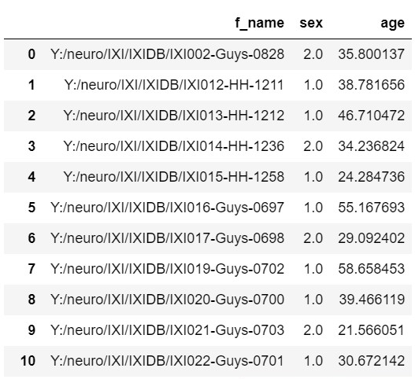
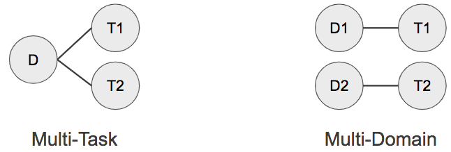

# 20.08.21

### csvfile을 만들기 위해 디렉토리와 엑셀을 연결하는 작업을 시행함.
### csvfilemaking . ipynb
 

1. 디렉토리의 경로 설정 이후 그 디렉토리의 파일 목록을 꺼내온다.

2. 그 디렉토리와 파일목록을 연결시켜 새로운 경로를 생성한다.

3. f_name이라는 column이름과 함께 dataframe에 넣어주면 일단 파일경로들의 dataframe완성

4. csv파일이 아닌 excel파일을 읽고 excel파일에 있는 IXI_ID를 꺼내 리스트로 만든 후 그 리스트에서 IXI만 있는 파일을 꺼내도록 if문을 설정해 IXI옆에 있는 숫자들을 꺼내온다.

5. 이 숫자들은 type이 str이므로 IXI_ID와 비교할 수 있도록 int형태로 바꿔야 한다. 그런데 atoi함수가 python에서 사라졌다! 그래서 int(뭐시기) 이렇게 해줬더니 float형태로 바꾸는 쓸데없는 수고를 해주어서 torch.tensor().int()로 다시 바꿔주었다.

6. np.array나 torch tensor형태에서는 index를 알아보거나 value를 제외하거나 등의 추가적인 기능을 할 수 없으므로 그럴 땐 .tolist()를 해줘야 한다. 그리고 torch tensor는 바로 .tolist()가 안되므로 np.array로 바꿔주었다가 list로 다시 바꿔줘야 한다. 

7. IXIDB에는 있지만 IXI엑셀에는 없는 수들을 리스트로 모으고 IXIDB의 숫자들의 목록들에서 제거해준다.

8. 그러면, 최종적으로 IXIDB와 IXI엑셀 모두에 있는 숫자들만 남게 될 것이고 IXIDB의 숫자들을 for문으로 돌리고 IXI_ID와 일치할 때의 sex, age를 np.array로 만든다.

9. 그리고 그 sex, age를 dataframe에 붙이고 그것을 csv파일로 변환한다.

결과이미지

- path = 디렉토리 경로 
os.listdir(path) : 디렉토리 내 파일목록을 주루룩 넣어줌

- str='IXI0988' 
str.startwith('IXI') = True (전방일치)

<pre>
<code>
not_in_list = [] # IXIDB에 있는데 IXI엑셀에는 없는 수들의 모음
for i in num:
    if i in IXI_ID:
        pass
    else:
        not_in_list.append(i)

# 특수한 if문인데 외우면 좋다. list에 없는 경우에 어떻게 할 것인가? 
</code>
</pre>

---
https://bskyvision.com/762 [디렉토리내 파일 목록 읽기]

https://ponyozzang.tistory.com/532 [문자열 부분일치 완전일치 전방일치 후방일치] 

https://musclebear.tistory.com/38 [문자열내 숫자만 추출] =>또 필요한 것은 그 string숫자를 integer로 변환

https://ldgeao99.tistory.com/8 [dataframe column추가]

https://wikidocs.net/14 [리스트 자료형에 대한 기능들]

# 20.08.24

- 교수님이 발표준비하라고 주신 Med3D논문을 읽다가 domain, multi-domain이라는 단어가 나왔다. 일반적으로는 영역이라는 뜻이지만 deep learning에서는 좀 더 다른 뜻이 있을까하고 찾아보았다. 

- 
여러 종류의 task를 수행하기 위한 환경의 조건은 크게 multi-task 또는 multi-domain 두 종류로 분류할 수 있습니다. 
 Multi-task learning의 경우 학습하려는 여러 종류의 task가 동일한 domain에 존재할 경우를 칭합니다. 얼굴 데이터로부터 얼굴 인식, 표정 인식, 성별 분류, 포즈 분류 등의 task를 모두 하나의 모델로 처리하고자 하는 경우를 예로 들 수 있습니다.  
반면 Multi-domain learning의 경우 학습하려는 여러 종류의 task가 각각 다른 domain에 존재할 경우를 칭합니다. 예를 들어 의료 이미지에서의 병변 검출, 일상 이미지에서의 카테고리 검출, 문자가 포함된 이미지에서의 문자열 검출 등의 task를 모두 하나의 모델로 처리하고자 할 경우입니다. 어플리케이션을 구축할 때 여러 종류 domain의 다른 task들을 수행해야 하는 경우가 종종 발생하게 됩니다.

- multi-domain learning의 장점
    1. 여러 domain 또는 task에서 동시에 잘 작동할 수 있는 shared feature를 학습할 수 있다면, 각각 독립적으로 모델을 구축했을 때 대비 굉장히 많은 양의 파라미터를 줄일 수 있습니다. 

    2. 만약 각 domain 간에 서로 시너지를 줄 수 있는 feature가 존재하고 이를 공유할 수 있다면, 하나의 task만 수행했을 때 보다 더 나은 성능을 기대할 수 있습니다.

- 즉, 논문에서 언급한 domain은 8개 각각의 segmentation dataset을 의미하는 뜻이었다. 

- reakyRelu라는 활성화 함수가 relu의 0 이하의 값 처리에 있어 나타나는 단점을 보완하는데 regression에 있어서는 더욱 중요한 것 같다.

- IXIDB2.csv로 age regression을 하고 있는데 파일을 croporpad를 할 때, 32 * 32 * 28까지 줄여야 돌아갈 수라도 있다. 원본 사이즈는 256 * 256 * z이어서(z값이 최대 120 최소 112이었다.) 256 * 256 * 112로 하니 cuda out of memory가 떠서 32 * 32 * 28까지 낮추었는데도 시간이 정말 오래걸릴 것 같다.

- epoch 하나 당, 거의 30분이상 걸리고 지금 epoch=3까지 해보았으나 결과값이 nan이 나옴.

- loss nan 나오는 이유
    1. 입력데이터 정규화를 하지 않아서
    2. learning rate가 너무 커서
    3. batch_size가 너무 작아서
    4. crossentropy시 log(0)
    5. relu -> leakyrelu
    6. 3D_TOF_reg_PD_seg.nii 데이터가 보이는 부분이 너무 작아서...?

- 

---
https://blog.lunit.io/2018/12/21/multi-domain-learning-in-deep-learning/ [multi-domain in deep learning]

seg- 혈관만 나타냄 
bin -  intesity 무시...> 0,1로만 표시
다운샘플링....
nifti_2p0부터 시작...
혈관만 있는 의료이미지 영상도 무조건 loss는 의미있는 값이 나와야 한다. 

vi test.py

뭐시기 뭐시기 만들기

python test.py를 누르면

실행스크립트 if __name
__ = '__main__'

1. 유학
2. 국내타대학원
3. 학석사연계 1년 단축
4. 취업

알바할수있다!