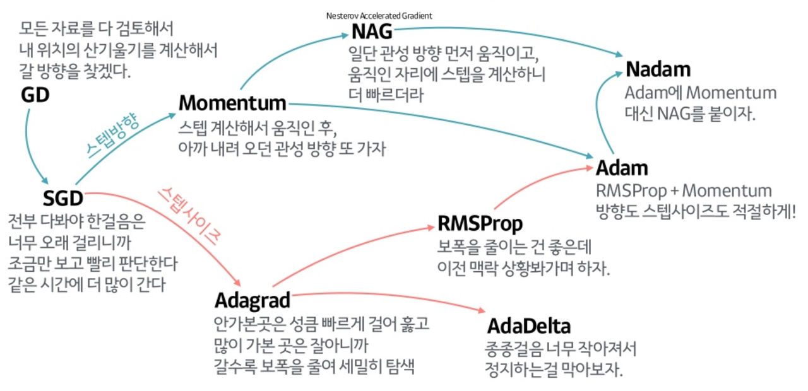

# 20.08.05

- sex classification 모델을 만들어 acc를 확인하는데 한 에포크 당 나오도록 하니 순간적으로 굉장히 낮은 acc를 보이거나 같은 acc가 반복적으로 나오는 경우도 있었다. 일희일비하지말라는 말이 왜 있는지 알 것 같다. 
- epoch=50에 70후반 80초반 이정도 나온다. 
- ROC커브만들기🤍
- confusion matrix
- 🧡gradCAM 연결해서 어디로 집중해서 나이나 성별을 predict하는지 살펴보기🧡

---
## LAB MEETING

1. 비슷한 contrast에 대해서는 correlation, contrast가 차이가 많이 나면 mutual info를 사용 이게 뭔 말일까?

2. data augmentation을 잘 쓸 줄 알아야 한다. 내가 만드는 deep learning에서 data augmentation을 무조건 다 하면 안돼!!

3. low resolution의 사진으로 시간이 짧게 걸리는 data augmentation을 시행해서 model training을 시켜보고 resolution도 높이고 data augmentation도 점점 추가해서 model의 안정도와 정확도 높여가기!

4. 데이터 augmentation 하나씩 어떤 기능을 하는지 확인해보기

5. 모델의 훈련데이터에 대한 어느정도의 오버피팅은 당연하다. 분류문제일시 acc이 95%이상이면서 valid는 그에 준해야 한다. 그렇지 않다면 그 모델자체는 쓸모가 없다.

6. 💛첫번째 목표는 바로바로 교수님이 주시는 코드를 이용해서 age regression에서 loss를 6이하로 만들기.💛

# 20.08.07

- 망막안저 의료영상으로 심혈관 질환 위혐요소를 예측하고 볼 수 있다는 논문(Popline et al.)을 읽음.

- 심혈관 질환 위험요소를 중간고사 대체프로젝트로 사용했던 데이터로 다뤄본 적이 있었다. 나이, 성별, BMI, 최대혈압, 최소혈압, 흡연여부, 혈당, 혈중 콜레스테롤, 혈압 등이 있다.

- 망막 자체가 심혈관 질환을 결정짓는 건 아니지만 망막 안저 의료 영상으로 발병의 위험성을 추론해볼 수 있고 안과 의사들이 그것에 민감하게 반응할 필요가 있음을 시사한 것이 아닌가라는 생각을 가지게 해준 논문이었다.

- 망막 안저 의료 영상으로 성별 구별이 뚜렷히 된다는 것이 신기했고 그 이유는 논문에 명확히 나오지 않았지만 개인적인 생각으로는, 성호르몬에 따른 망막의 blood flow의 차이(Yanagida et al.)때문인 것 같다.

- 서울대병원 안과에서도 이와 같은 연구를 진행하였다. 딥러닝을 이용해 안저 의료 영상으로 성별과 나이를 정확하게 예측하고 기저질환은 이에 영향을 미치지 않는다. 

- 뇌혈관 나이, 망막 안저 의료영상으로 나이 예측 등 노화진행을 사람들은 딥러닝으로 왜 예측하고 싶어할까? 그만큼 노화가 질환발병에 큰 영향을 많이 미치기 때문인 것 같다. 

# 20.08.10

-  왜 loss가 잘 안나오는지 여기서 알 수 있다. for (image_path, i, j) in zip(image_paths, target_age, target_sex)에서 i를 인덱스처럼 받아드리는 것이 아니라 target_age의 value를 i에 넣는 것이었다. 그래서 AGE : i, SEX : j로 하면 된다.

- transform을 validation에 넣지 않고 진행해보니 loss가 1000단위로 나온다. 왜 그러지

- optimizer들간의 차이를 설명한 좋은 사진 

# 20.08.12

## LAB MEETING

1. 코드 버전 관리하기

2. 깃허브나 클라우드로 의미있는 버전들 쌓아놓기

3. prior knowledge + advanced network...>_</

4. 💛validation set의 실제값과 예측값의 관계를 나타낸 scatter plot을 python으로 나타냄으로써 linearity를 확인해보기💛

5. brain mri image가 뇌졸중 고혈압 등만 진단하고 보관되는 데이터로 취급되는게 아까워서 이 데이터를 이용해 할 수 있는 다양한 task들이 이뤄졌으면 좋겠다.

6. 의료계의 발전? 또 다른 application을 보여줄 수 있도록 해야되니께...딥러닝을 잘 하자능...

7. 기계가 uncertainty를 알려줌. reliability를 고려...ㅎ dice score은 groundtruth가 필요한데 ious는 groundtruth가 필요없다. 

8. hufsaim0 -> neuro -> 파일 -> nifiti ->fsl_~->3D_T1_reg_PD_brain_fast_seg에서 WM, GM 분리 잘되어 있는지, 눈이나 뇌가 아닌 부분을 포함하고 있는지 확인, 결과가 없는 데이터 확인.

9. grad CAM으로 기계가 어디에 집중해서 이미지를 분석했는지 파악가능하도록...ㅎ