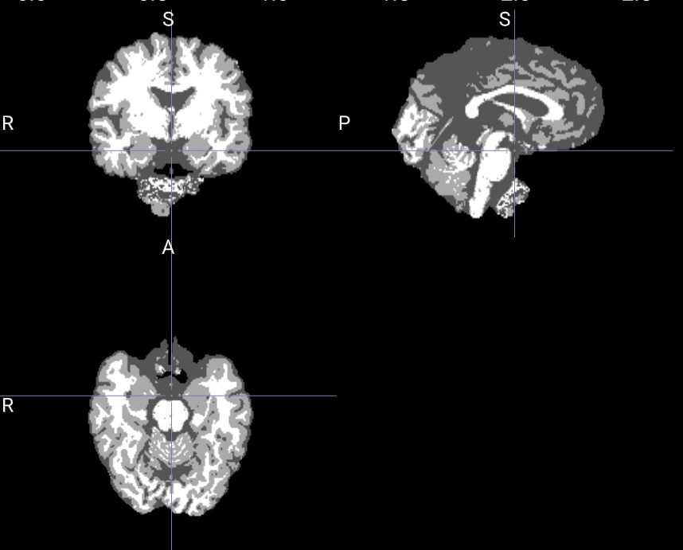
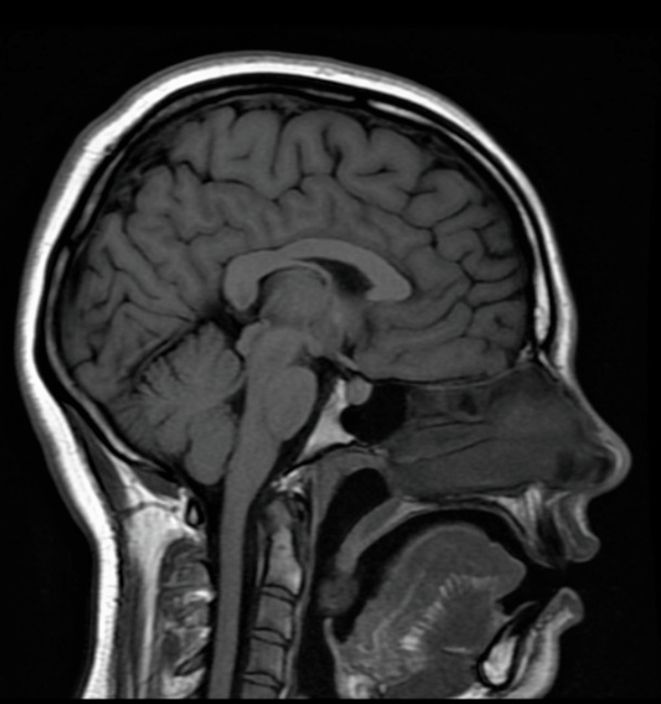
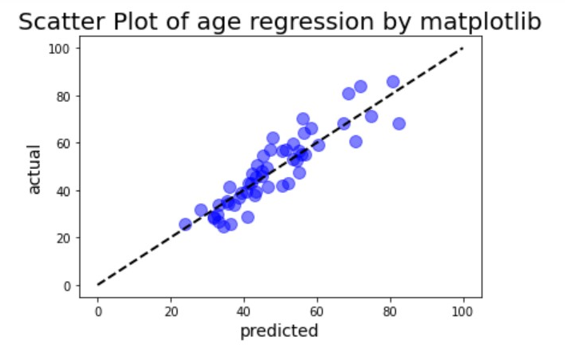
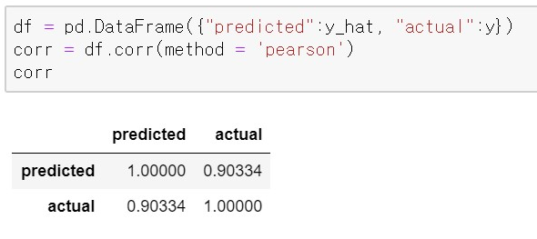
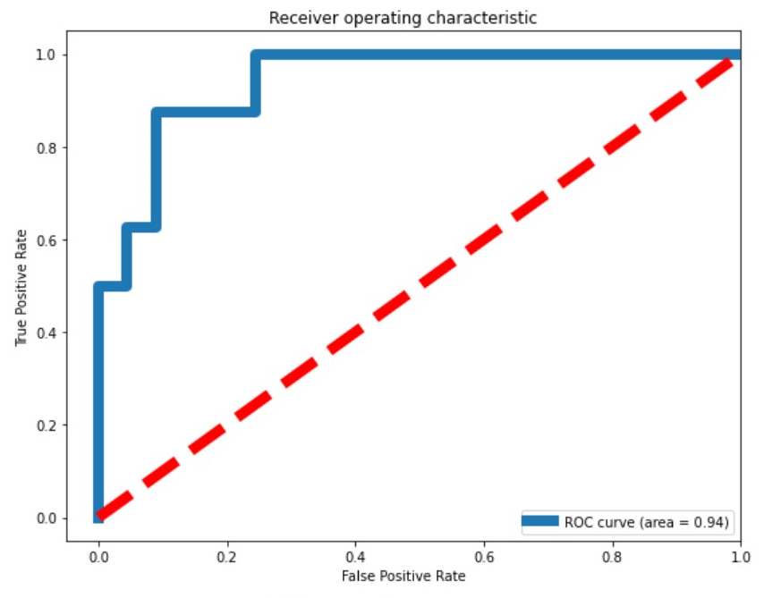
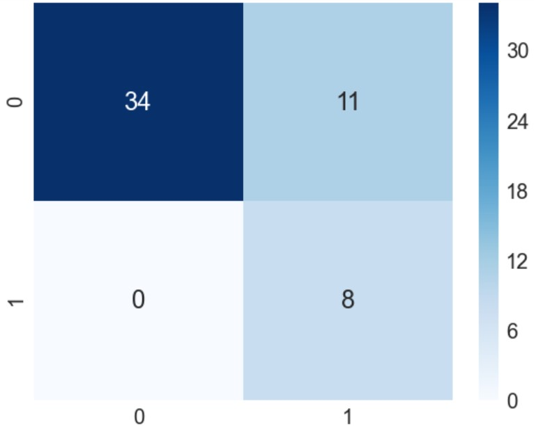

# 20.08.14

- hufsaim0에 있는 IXI DATA를 내 컴퓨터로 옮기는데 꼬박 하루가 걸림.

- MRcroGL로 뒤 옆 위 모두를 보면서 온전하지 못한 MRI 영상을 찾아냄

- 영상을 찾아보며 느낀 것은 사람의 뇌도 외모처럼 다 다르다는 것이다. 어떤 사람의 뇌는 위에서 보았을 때 매우 길고 컸다. 얼굴비대칭처럼 뇌도 한 쪽이 더 큰 비대칭도 보았다. 생물학 책에서 보던 뇌는 가장 평범한 모양의 뇌였다. 깊게 생각해본 적 없지만 왜 brain image로 나이와 성별을 구분할 수 있는지 알 것 같았다.

- 원래 MRI로 brain을 찍고자 하면 brain만 찍혀 나오는 것이 아니라 눈 코 목 뼈 등등이 다 찍히는데 뇌만 나오도록 나머지를 processing을 통해 거친 듯 하다. 다만 그것이 완전하지 못해서 labeling이 제대로 되었는지를 확인할 필요가 있는 듯 하다.

- 전체를 다 보진 않았지만 가장 많은 오류는 연수부분에 추가로 무엇가 달려있는 것이다.  

-  처리 전 brain mri image인데 어떤 신체구조가 왜 뇌로 착각되는지 궁금하다.

- 'for batch in validation_loader:' 이 부분에서 목요일부터 계속 에러가 나는데 pickling error란다. 예전에는 잘만 되더니...?

---
 [AI 학습을 위한 데이터 모음 사이트](https://appen.com/)

  

# 20.08.17

- pickling error를 검색해보니 dataloader의 num_workers때문이었다. 그래서 default인 0으로 다시 설정해주니 잘 돌아갔다.

- **dataloader에서 num_workers의 정의** :  
이 모듈에서 num_workers라는 파라미터는 어디에 쓰이는 것일까요? 이름에서도 유추할 수 있듯이 멀티 프로세싱과 관련된 파라미터입니다. 머신 러닝 학습을 좀 더 빠르게 진행하는데 사용되는 GPU는 기본적으로 CPU의 컨트롤을 받기 때문에 CPU의 성능도 GPU의 속도에 지대한 영향을 줄 수 있습니다. num_workers은 학습 도중 CPU의 작업을 몇 개의 코어를 사용해서 진행할지에 대한 설정 파라미터입니다. 해당 환경에서 사용 가능한 코어의 개수를 확인해보고 학습 외의 작업에 영향을 주지 않을 정도의 숫자로 설정해주시는 것이 좋습니다. 

- 
예측값과 실제값이 linearity를 띄는 것을 볼 수 있다. 

- 
실제값과 예측값의 상관계수는 0.903으로 1에 가까운 양의 상관관계를 보이고 있다.

- sex classification에서도 subject를 만들 때, 실수를 한 부분을 고쳐서 다시 모델을 학습시켰다. 

    - epoch = 50, train_loss = 0.411, valid_loss = 0.44790196418762207, 
    acc = 0.7924528121948242가 나왔다.

---
[Dataloader의 num_workers blog](https://jybaek.tistory.com/799)