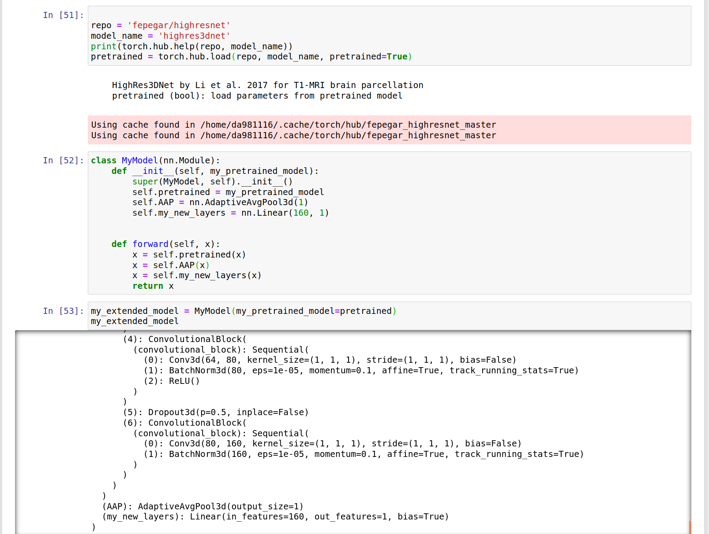
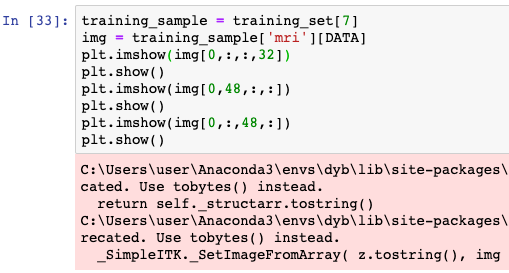
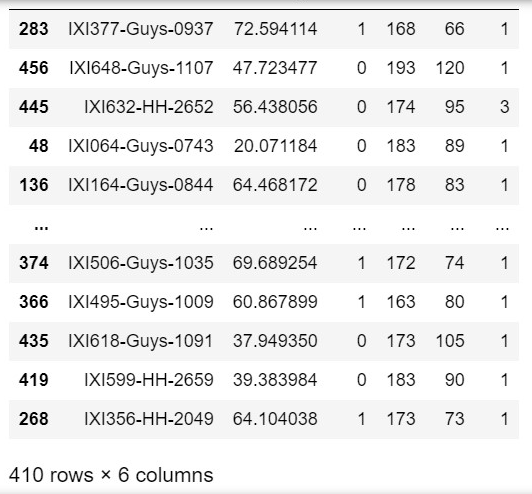

# 20.08.28

- 3D_TOF_reg_PD_bin.nii.gz, 뇌혈관 의료영상으로 딥러닝을 하니 그나마 bin 처리를 하기 전보다는 결과가 나오기는 했다.

- T1과 TOF의 비교를 위해 모델 훈련을 하고 있는데 조건이 valid set은 표본의 수가 50개이고 연령의 분포가 균일분포여야 하며, 최종 valid loss값이 6~7이하여야 한다. 

- 균일분포로 뽑히도록 하기 위해 코딩을 생각해봤는데 train_test_split에서 random_state를 조절해 그나마 균일분포에 가까운 것을 찾는게 나을 것 같다고 생각해 그렇게 진행하였다. 

- 이 그래프처럼  data augmentation에 의해 valid_loss가 train_loss보다 낮을 수도 있음!! 

- transform중 randombiasfield를 추가하니 시간은 더 늘어났는데 어째 loss가 13,14에서 머물러있는 느낌이다...ㅠㅠ일단 epoch=50까지의 결과를 지켜보고 그래도 안 나오면 시간이 오래 걸리는 transform를 제외하고 모델 architecture를 바꿔봐야 할 것 같다.

- model에서 conv3d를 추가해보고 dropout를 빼보고 추가해보고 했다. dropout를 빼니 overfitting(train_loss가 더 낮게 나옴)은 일어나는데 valid_loss가 20이상이다. 10이하라도 7이상이면 돌아버리겠는데 20이상이라니^^

# 20.08.31

- 학교에 와서 리눅스로 jupyter notebook을 시행하고자 하니 pytorch 설치도 해주어야 했고 네트워크 드라이브 연결하는 것도 헤매다가 다시 올바르게 연결해주었다. 그리고 생각보다 ram이 빠르지 않은 듯 하다. 

- loss가 너무 안 줄어서 pretrained highresnet 3d를 가져온 후 마지막에 fc를 추가해 regression을 해볼까 했다.

- 
highresnet을 가져오고 그 뒤에 adaptive average pooling과 linear을 가져와서 붙여주었다.
그러나, 모델 자체 complexity가 너무 높아 cuda out of memory가 떴다. 

- ixi_tiny에 맞춘 모델이라 잘 안 돌아가는 것 같아 일부러 layer들을 더 제거해보았다. 결과는 더 안 좋았다.

- parameter initialization을 없애니 모델을 다시 돌릴 때마다 초기화가 되지 않아 저번때 나온 weight들에서 약간의 수정을 거치기에 학습이 더 원활해지는 것 같다. 

- batch normalization은 batchsize가 너무 커도 error가 높을 수 있지만 너무 작아도(64미만) 안된다. 그러나 batchsize가 작아도 deep model이라면 covariate shift를 어느정도 방지 할 수 있어 model complexity가 크다면 batchnorm을 사용해주는 것이 좋다.

- covariate shift는 원본 데이터의 분포와 레이어를 거친 후의 데이터의 분포 모양의 차이가 나타나는 것을 의미한다.

- to avoid exploding or vanishing gradients while learning, param initialization is needed. but you should know that Xavier is working well with tanh activation func and He is working well with ReLU func.

- 
preprocessing의 상태를 보는 코드...반성하자...ㅎ

- train_test_split에서의 나의 문제점을 발견했다. 
fn 왼쪽의 값들이 index인데 이것을 리스트로 만들어서 for문을 돌려 이 인덱스에 해당하는 fn을 training set으로 넣어줘야 하는데 df의 0~409까지의 index를 training set에 나머지를 valid set에 넣었다. 실수 조심해라 제발

---
https://discuss.pytorch.org/t/add-layers-on-pretrained-model/88760/3 [pretrained model에 원하는 layer adding]

https://www.deeplearning.ai/ai-notes/initialization/ [parameter initialization이 왜 필요한가?]