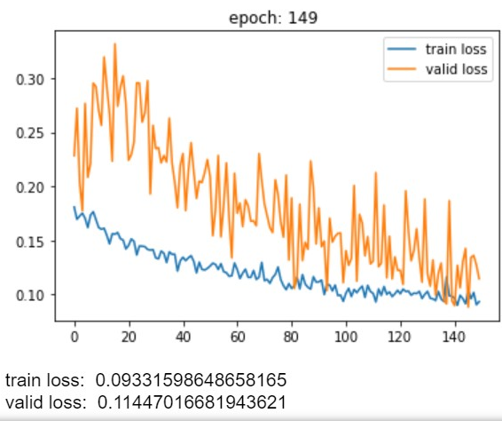

# 20.09.04

- 90번에서 컴퓨터가 꺼져서 model parameter를 불러와 10번을 더 돌린 결과와 다시 처음부터 100번을 돌린 결과가 다르다. 전자는 valid_loss가 6대였는데 후자는 8대였다.

- 그래서 모델 parameter를 다시 불러와서 50번을 추가로 돌려 더 좋은 결과가 나오는지 봐야겠다.

- 100번 이후로부터는 딱히 더 나은 결과랄게 없는 거 같긴 하다. 그래도 더 돌리니 7대로 떨어지긴 했다.
//T1

- TOF는 같은 모델에서 하이퍼파라미터까지 같을 때 loss가 8대가 나오고 epoch 100이상 훈련을 시켰는데 더 올라가고 떨어지진 않았다.

# 20.09.08

-  
t1의 최종 그래프 모양(epoch-150)

- 
t1 최종 훈련된 모델로 나온 valid의 scatterplot

- 
t1 최종 훈련된 모델로 나온 valid의 상관계수

- 
TOF최종 그래프, lr=0.00001로 바꾼 후 다시 돌리니 loss가 다시 올라감.
- 
TOF 최종 훈련된 모델로 나온 valid의 scatterplot
- 
TOF 최종 훈련된 모델로 나온 valid의 상관계수

-  
TOF transform에 randommotion추가한 후 epoch=150까지 돌린 결과

-  
T1 transform에 randommotion추가한 후 epoch=100까지 돌린 결과
