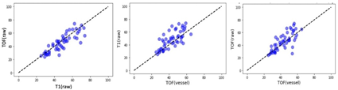
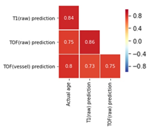
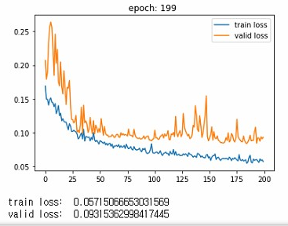
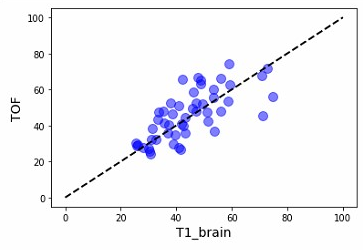
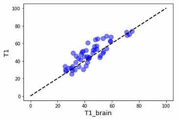
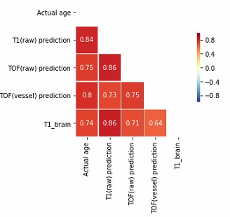

# 20.09.11

- 

각 모델들의 나이 예측값을 scatterplot과 correlation coefficient으로 나타내었는데 T1과 TOF의 correlation coefficient가 제일 높게 나왔다.

- T1으로 valid_loss 7대를 만들고 그 모델로 tof와 tof_bin을 훈련하였다. tof의 valid_loss가 8대였지만 가장 상관계수는 높은 것을 보면 두 모델이 actual age를 기준으로 predicted age를 비슷한 흐름으로 맞춘 것 같다.

- TOF(vessel)은  당연히 TOF predicted age와 가장 높을 줄 알았는데 actual age와 correlation coeffienct가 제일 높다.

- 뇌혈관만 담긴 TOF(vessel)이 다른 두 모델보다 actual age와 상관계수도 가깝고 그래프를 보면 주로 T1과 TOF(raw)가 TOF(vessel)보다 나이를 더 높게 예측한 것을 볼 수 있다. 그리고 T1과 TOF의 연관도는 높은 것으로 보아 뇌의 노화에 있어 TOF(vessel)부분을 제외한 T1과 TOF에서 보이는 부분이 더 빠르게 일어남을 알 수 있다. 

# 20.09.14

-  
t1_brain으로 모델 훈련을 시킨 결과이다. 그런데 가장 결과가 안 좋은 모델이다. 

- train loss에 있어서는 가장 낮은 loss를 보여주었으나 valid loss는 가장 높다. overfitting이 제대로 일어난 듯 하다.

- 
t1_brain에 비해 tof와 t1의 예측값은 주로 더 높게 측정된 것을 볼 수 있다. 그리고 tof_bin에 비해서는 t1_brain이 더 나이를 높게 예측한 것을 볼 수 있다.

- 생각보다 t1과 t1_brain의 상관계수가 높지 않다. MRI T1에서 뇌를 제외한 부분이 나이 예측에 영향을 주는 듯 하다.